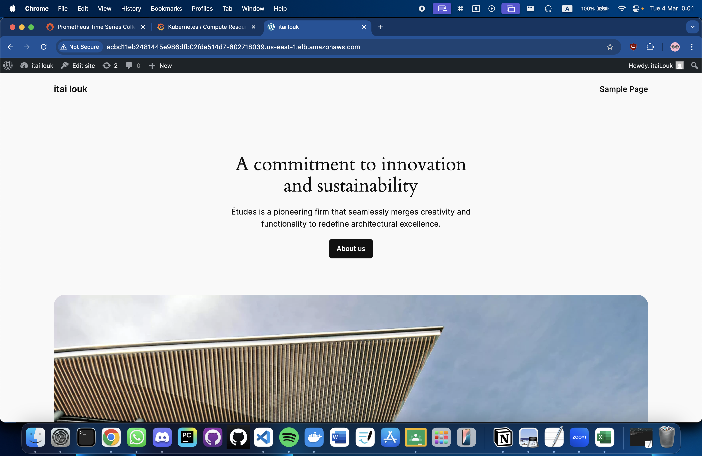
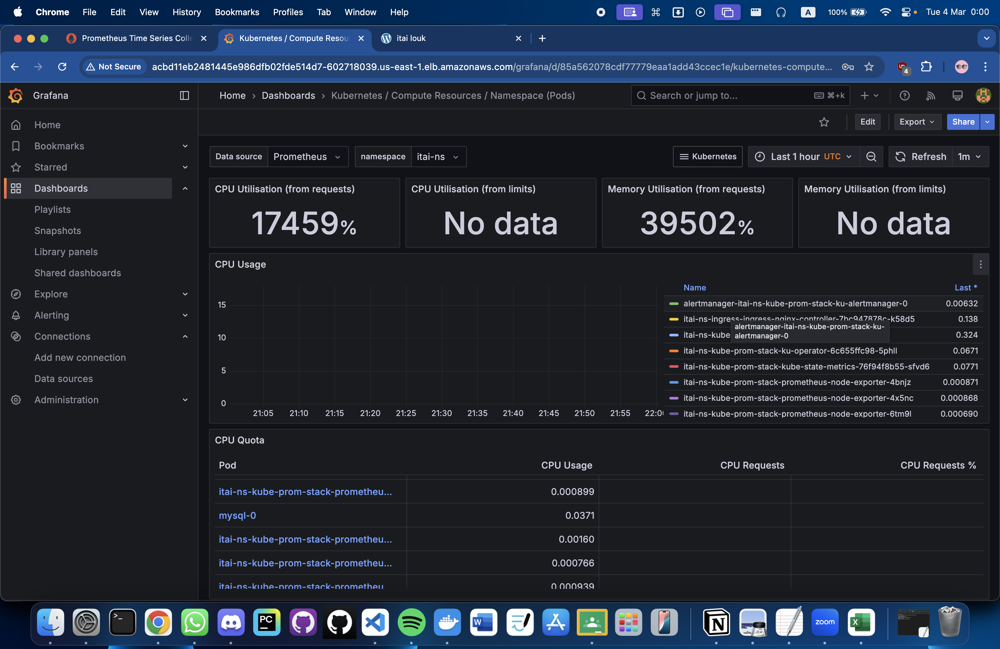

# WordPress on EKS with Ingress and Monitoring

This project deploys a WordPress application with a MySQL database on Amazon EKS (Elastic Kubernetes Service), using an NGINX Ingress Controller for external access and Kube Prometheus Stack with grafana for monitoring . 

## Project Overview

- **Application**: WordPress (web frontend) and MySQL (database backend).
- **Cluster**: Amazon EKS, namespace `itai-ns`.
- **Storage**: AWS EBS (via a custom StorageClass `itai-ebs-sc`).
- **Networking**: NGINX Ingress Controller with an AWS ALB for external access.
- **Monitoring**: Kube Prometheus Stack with Grafana dashboards 
- **Secrets**: Used Kubernetes Secrets (`mysql-secrets`) to securely manage MySQL credentials and authentication.


## Architecture

The architecture leverages Kubernetes resources on EKS:

1. **MySQL**:
   - **StatefulSet**: `mysql` with 2 replica ensures stable identity and persistent storage.
   - **PVC**: `mysql-storage-mysql-0` uses `itai-ebs-sc` StorageClass (2Gi, EBS gp3 volume) mounted at `/var/lib/mysql`.
   - **Secrets**: MySQL credentials (root password and user password) are sourced from the `mysql-secrets` Secret, enhancing security by avoiding plaintext in the YAML.
   - **Service**: Headless (`ClusterIP: None`) at `mysql.itai-ns.svc.cluster.local:3306` for direct pod access.

2. **WordPress**:
   - **Deployment**: `wordpress` with 2 replica for stateless web serving.
   - **Storage**: Uses `emptyDir` (ephemeral storage) at `/var/www/html`—data persists in MySQL.
   - **Service**: `wordpress` (ClusterIP) exposes port 80.

3. **Ingress**:
   - **Controller**: NGINX (`itai-ns-ingress-ingress-nginx-controller`) with a LoadBalancer service, providing an ALB at `acbd11eb2481445e986dfb02fde514d7-602718039.us-east-1.elb.amazonaws.com`.
   - **Ingress Resource**: `wordpress-ingress` routes traffic from `/` to the `wordpress` service on port 80.

4. **Monitoring**:
   - **Kube Prometheus Stack**: Installed via Helm (`itai-ns-kube-prom-stack`) with Prometheus, Grafana, and kube-state-metrics.
   - **Grafana Dashboard**: Tracks WordPress uptime using the query: `(time() - container_start_time_seconds{pod=~"wordpress.*", namespace="itai-ns"}) / 60`.

5. **Secrets**:
   - `mysql-secrets`: Stores MySQL root and user passwords, referenced in the MySQL StatefulSet.
   - `ecr-secret`: Pulls images from AWS ECR.

## File Architecture

- **`mysql.yml`**: Defines the MySQL StatefulSet, Service, and volume claim with Secrets for credentials.
- **`wordpress.yml`**: Configures the WordPress Deployment and ClusterIP Service.
- **`ingress.yml`**: Sets up the Ingress resource for routing traffic to WordPress.
- **`storageclass.yml`**: Creates the custom `itai-ebs-sc` StorageClass for EBS storage.
- **`grafana-dashboard.png`**: Screenshot of the Grafana uptime dashboard.
- **`wordpress-site.png`**: Screenshot of the WordPress site via Ingress.
- **`Helm charts`** that rapes everything up:
```bash
.
├── Chart.yaml
├── charts
├── templates
│   ├── ingress.yaml
│   ├── mysql-service.yaml
│   ├── mysql-statefulset.yaml
│   ├── secrets.yaml
│   ├── storageclass.yaml
│   ├── wordpress-deployment.yaml
│   └── wordpress-service.yaml
└── values.yaml
```


## Setup Steps

### Prerequisites

- AWS EKS cluster with `kubectl` configured.
- Helm installed.
- AWS CLI with ECR access.


### Step 1: Build and Push Docker Images to ecr

### Step 2: Create Secrets

#### MySQL Credentials Secret
```bash
kubectl create secret generic mysql-secrets --namespace itai-ns   --from-literal=mysql-root-password=<your-root-password>   --from-literal=mysql-user-password=<your-user-password>
```

#### ECR Pull Secret
```bash
kubectl create secret docker-registry ecr-secret --namespace itai-ns   --docker-server=992382545251.dkr.ecr.us-east-1.amazonaws.com   --docker-username=AWS   --docker-password=$(aws ecr get-login-password --region us-east-1)
```

### Step 3: Deploy MySQL and WordPress

#### Apply StorageClass 
```bash
kubectl apply -f mysql.yml -n itai-ns
```

#### Apply MySQL
```bash
kubectl apply -f mysql.yml -n itai-ns
```
#### Apply WordPress
```bash
kubectl apply -f wordpress.yml -n itai-ns
```

### Step 4: Set Up Ingress

#### Install NGINX Ingress Controller via Helm
```bash
helm install itai-ns-ingress ingress-nginx/ingress-nginx --namespace itai-ns
```

#### Apply Ingress Resource
```bash
kubectl apply -f ingress.yml -n itai-ns  
```

### Step 5: Add Monitoring

#### Install via Helm
```bash
helm install itai-ns-kube-prom-stack prometheus-community/kube-prometheus-stack --namespace itai-ns   
```

#### Port-Forward Grafana
```bash
kubectl port-forward -n itai-ns svc/itai-ns-kube-prom-stack-grafana 3000:80
```


## Using ALB Instead of Ingress

Modify `wordpress.yml` to use a LoadBalancer service:

```yaml
apiVersion: v1
kind: Service
metadata:
  name: wordpress
  namespace: itai-ns
spec:
  type: LoadBalancer
  selector:
    app: wordpress
  ports:
  - port: 80
    targetPort: 80
```

Apply the updated service:
```bash
kubectl apply -f wordpress.yml -n itai-ns
```

Retrieve the ALB URL:
```bash
kubectl get svc wordpress -n itai-ns
```

Access WordPress at `http://<wordpress-alb-url>`.


pic of wordpress connection:


pic of grafana dashboard:

